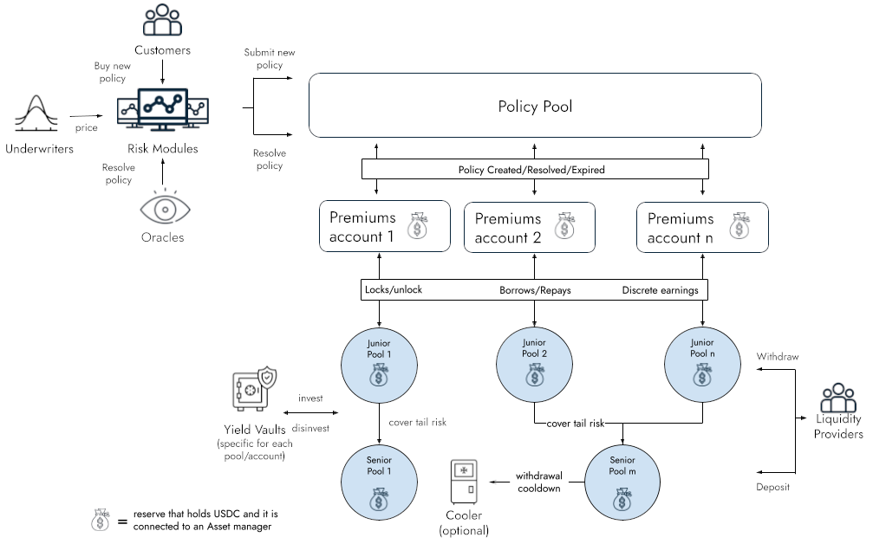

[](https://github.com/ensuro/ensuro/actions/workflows/tests.yaml)
[](https://github.com/ensuro/ensuro/actions/workflows/tests.yaml)
[](https://github.com/ensuro/ensuro/actions/workflows/build-base-image.yaml)

# Ensuro - Decentralized capital for insurance

Ensuro is a decentralized protocol that manages the capital to support insurance products.

It allows liquidity providers (LPs) to deposit capital (using stable coins) that will fulfill solvency capital requirements of underwritten policies. This capital will be deposited in different pools (_eTokens_) that are linked to different risks. The capital will be locked for the duration of policies and will report profits to the LPs in the form of continous interest.

On the policy side, the policies are injected into the protocol by _Risk Modules_. Each risk module represent an Ensuro partner and a specific insurance product and is implemented with a smart contract (inherited from `RiskModule`). Each risk module has two responsabilities: pricing and policy resolution. Also, the RiskModule smart contract stores several parameters of the risk module such as Ensuro and Risk Module fees, capital allocation limits, etc.

Each policy sold and active it's a _risk_ or potential loss, a random variable that goes from 0 (no losses) to the maximum payout defined in the policy. The solvency capital to cover these risks comes from two sources:

- **pure premiums**: the part of the premium that's equal to the estimated mean of the risk random variable (expected losses), paid by the policy holder.
- **scr**: the rest of the solvency capital (unexpected losses), required to be able to cover the risks with a given _confidence level_, is locked from the _eTokens_.



## Contracts

<dl>
<dt>PolicyPool</dt>
<dd>This is the main contract that keeps track of active policies and manages the assets. It has the methods for LP to deposit/withdraw. The PolicyPool is connected to a set of eTokens and RiskModules.</dd>
</dl>

<dl>
<dt>PolicyNFT</dt>
<dd>This contract follows ERC721 standard to control the ownership of the policies (each policy is an NFT). Policies are minted by PolicyPool.</dd>
</dl>

<dl>
<dt>PolicyPoolConfig</dt>
<dd>This contract holds some configurable components of the protocol such as treasury address and the installed risk modules. Also this module holds the access control permissions for the governance actions.</dd>
</dl>

<dl>
<dt>EToken</dt>
<dd>This is a ERC20 compatible contract that represents the capital of each liquidity provider in a given pool. The valuation is one-to-one with the underlyng stablecoin. The view scr() returns the amount of capital that's locked backing up policies. For this capital locked, the pool receives an interest (scrInterestRate() / tokenInterestRate()) that is continously accrued in the balance of eToken holders.</dd>
</dl>

<dl>
<dt>RiskModule</dt>
<dd>This is a base contract that needs to be reimplemented with the specific logic related with custom policy parameters, validation of the received price and with different strategies for policy resolution (e.g. using oracles). This is the contract that must be called by a customer for creating a new policy that, after doing validations and storing parameters needed for resolution, will submit the new policy to the PolicyPool.</dd>
</dl>

<dl>
<dt>PremiumsAccount</dt>
<dd>The risk modules are grouped in *premiums accounts* that keep track of the pure premiums (active and earned) their policies. The responsability of these contracts is keeping track of the premiums and releasing the payouts. When premiums are exhausted (losses more than expected), they borrow money from the *eTokens* to cover the payouts. This money will be repaid when/if later the premiums account has surplus (losses less than expected).</dd>
</dl>

<dl>
<dt>LPWhitelist</dt>
<dd>This is an optional component. If present it controls which Liquidity Providers can deposit or transfer their <i>eTokens</i>.</dd>
</dl>

<dl>
<dt>Policy</dt>
<dd>This is a library with the struct and the calculation of relevant attributes of a policy. It includes the logic around the distribution of the premium, calculation of SCR, shared coverage and other behaviour of the protocol.</dd>
</dl>

## Governance

The protocol uses three levels of access control, plus a guardian role. The roles are managed by the PolicyPoolConfig smart contract.

More info about governance in https://docs.google.com/spreadsheets/d/1LqlogRn8AlnLq1rPTd5UT7CJI3uc31PdBaxj4pX3mtE/edit?usp=sharing

## Development

For coding the smart contracts the approach we took was prototyping initially in Python (see folder `prototype`), and later we coded in Solidity. The tests run the same test case both on the Python prototype code and the Solidity code. To adapt the Solidity code that is called using [brownie](https://eth-brownie.readthedocs.io/en/stable/), we have some glue code implemented in `tests/wrappers.py`.

### Without docker

You can also run the development environment without using docker, just Python (>=3.9) and Node v16 are required as pre-requisits.

Initial setup:

```bash
# Setup a virtualenv
python3 -m venv venv
source venv/bin/activate
# Install python dependencies
pip install -r requirements.txt
pip install -r requirements-dev.txt
# Install javascript dependencies
nvm use  # To change to node v16
npm install
```

Then, you can run the tests with:

```bash
brownie test -v
npx hardhat test
```

### Using docker

The development environment is prepared for running inside a docker container defined in the Dockerfile. Also you can launch the docker environment using [invoke tasks](http://www.pyinvoke.org/), but before you need to run `pip install inv-py-docker-k8s-tasks` to install a package with common tasks for coding inside docker. Then with `inv start-dev` you should be able to launch the docker environment. Then you can run specific tasks:

- `inv test`: runs the test suite
- `inv shell`: opens a shell inside the docker container

Also the docker container is prepared to run [hardhat](https://hardhat.org/). This will be used probably for deployment scripts and perhaps some aditional tests.

## Code Audits

- Audit by [SlowMist](https://www.slowmist.com) - 2021-09-29: [AuditReport](audits/SlowMistAuditReport-Ensuro-2021-09-29.pdf)

## Contributing

Thank you for your interest in Ensuro! Head over to our [Contributing Guidelines](CONTRIBUTING.md) for instructions on how to sign our Contributors Agreement and get started with
Ensuro!

Please note we have a [Code of Conduct](CODE_OF_CONDUCT.md), please follow it in all your interactions with the project.

## Authors

- _Guillermo M. Narvaja_

## License

The repository and all contributions are licensed under
[APACHE 2.0](https://www.apache.org/licenses/LICENSE-2.0). Please review our [LICENSE](LICENSE) file.
