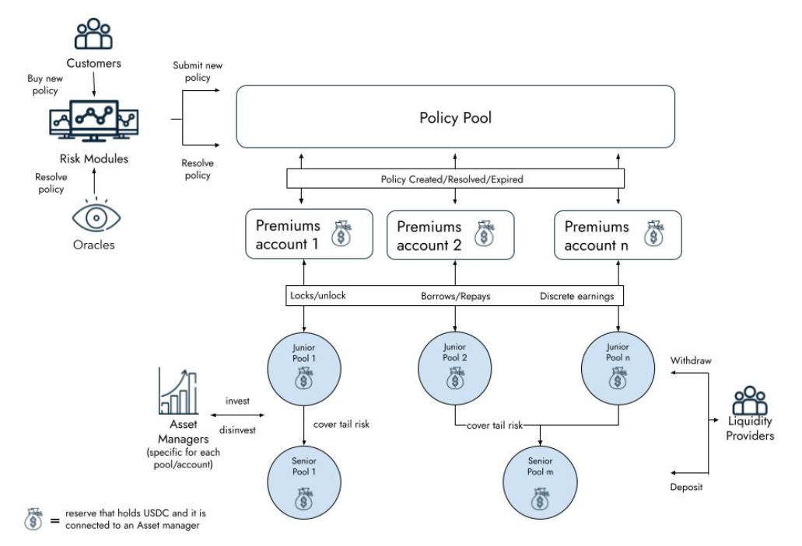

# Ensuro - Decentralized capital for insurance

Ensuro is a decentralized protocol that manages the capital to support insurance products. 

It allows liquidity providers (LPs) to deposit capital (using stable coins) that will fulfill solvency capital requirements of underwritten policies. This capital will be deposited in different pools (*eTokens*) according to provider's cashback period preferences. The capital will be locked for the duration of policies and will report profits to the LPs in the form of continous interest.

On the policy side, the policies are injected into the protocol by *Risk Modules*. Each risk module represent an Ensuro partner and a specific insurance product and is implemented with a smart contract (inherited from `RiskModule`). Each risk module has two responsabilities: pricing and policy resolution. Also, the RiskModule smart contract stores several parameters of the risk module such as Ensuro and Risk Module fees, capital allocation limits, etc.

## Contracts
<dl>
<dt>PolicyPool</dt>
<dd>This is the main contract that keeps track of active policies and manages the assets. It has the methods for LP to deposit/withdraw. The PolicyPool is connected to a set of eTokens and RiskModules.</dd>
</dl>

<dl>
<dt>PolicyNFT</dt>
<dd>This contract follows ERC721 standard to control the ownership of the policies (each policy is an NFT). Policies are minted by PolicyPool.</dd>
</dl>

<dl>
<dt>PolicyPoolConfig</dt>
<dd>This contract holds some configurable components of the protocol such as treasury address, InsolvencyHook, AssetManager and the installed risk modules. Also this module holds the access control permissions for the governance actions.</dd>
</dl>

<dl>
<dt>EToken</dt>
<dd>This is a ERC20 compatible contract that represents the capital of each liquidity provider in a given pool. The valuation is one-to-one with the underlyng stablecoin. The view `scr()` returns the amount of capital that's locked backing up policies. For this capital locked, the pool receives an interest (`scrInterestRate()` / `tokenInterestRate()`) that is continously accrued in the balance of eToken holders.</dd>
</dl>

<dl>
<dt>RiskModule</dt>
<dd>This is a base contract that needs to be reimplemented with the specific logic related with custom policy parameters, validation of the received price and with different strategies for policy resolution (e.g. using oracles). This is the contract that must be called by a customer for creating a new policy that, after doing validations and storing parameters needed for resolution, will submit the new policy to the PolicyPool.</dd>
  </dl>

<dl>
<dt>AssetManager</dt>
<dd>This component of the protocol is the one responsible for managing the assets and getting additional interest reinvesting the assets. Different implementations of the asset management can be done, depeding on the strategy to be applied. In the base class, has different liquidity parameters that affect how much liquidity to keep in the PolicyPool to avoid continous invest/deinvest operations.</dd>
</dl>

<dl>
<dt>InsolvencyHook</dt>
<dd>This component of the protocol is the one responsible for handling situations where there is not enough money in the protocol to cover losses (something unluckily possible since we aren't fully collaterized). Possible implementations of this are trigger of reinsurance (excess loss) policy from another company, sell governance tokens or take a loan.</dd>
</dl>

<dl>
<dt>Policy</dt>
<dd>This is a library with the struct and the calculation of relevant attributes of a policy. It includes the logic around the distribution of the premium, calculation of SCR, shared coverage and other behaviour of the protocol.</dd>
</dl>

## Development

For coding the smart contracts the approach we took was prototyping initially in Python (see folder `prototype`), and later we coded in Solidity. The tests run the same test case both on the Python prototype code and the Solidity code. To adapt the Solidity code that is called using [brownie](https://eth-brownie.readthedocs.io/en/stable/), we have some glue code implemented in `tests/wrappers.py`.

The development environment is prepared for running inside a docker container defined in the Dockerfile. Also you can launch the docker environment using [invoke tasks](http://www.pyinvoke.org/), but before you need to run `pip install inv-py-docker-k8s-tasks` to install a package with common tasks for coding inside docker. Then with `inv start-dev` you should be able to launch the docker environment. Then you can run specific tasks:
- `inv tests`: runs the test suite
- `inv shell`: opens a shell inside the docker container 

Also the docker container is prepared to run [hardhat](https://hardhat.org/). This will be used probably for deployment scripts and perhaps some aditional tests.

## Contributing

Thank you for your interest in Ensuro! Head over to our [Contributing Guidelines](CONTRIBUTING.md) for instructions on how to sign our Contributors Agreement and get started with
Ensuro!

Please note we have a [Code of Conduct](CODE_OF_CONDUCT.md), please follow it in all your interactions with the project.

## Authors

* *Guillermo M. Narvaja*

## License

The repository and all contributions are licensed under
[APACHE 2.0](https://www.apache.org/licenses/LICENSE-2.0). Please review our [LICENSE](LICENSE) file.
